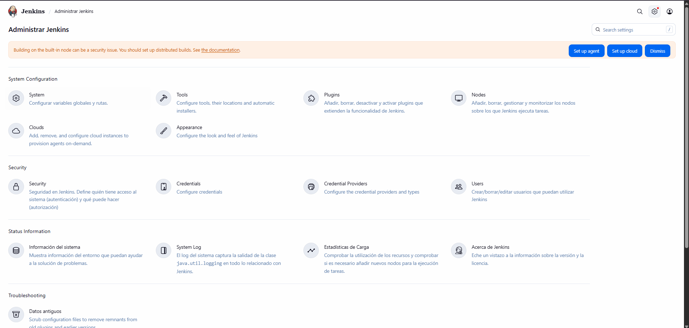
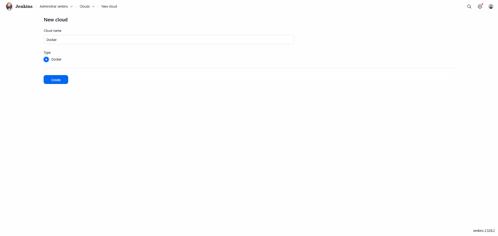

# Configuración de la nube en Jenkins

Una vez iniciado sesión en Jenkins, dirígete al menú lateral y selecciona:

```
Manage Jenkins > Clouds
```

Dentro de esta sección, es necesario configurar la nube en caso de que el proyecto utilice **contenedores o agentes externos** para ejecutar los pipelines.  
Esta configuración permite que Jenkins cree **entornos de ejecución automáticos** para las tareas del pipeline.

---

## Paso 1: Acceder al panel de Cloud

  
_Pantalla de configuración de la nube de Jenkins._

En la vista de configuración, se muestra el módulo correspondiente a **Cloud**, el cual inicialmente aparece vacío. Desde aquí se puede:

- Agregar un nuevo proveedor de Cloud.
- Configurar Docker como agente dinámico.
- Especificar credenciales.

---

## Paso 2: Crear un nuevo Cloud

1. Haz clic en **Agregar nuevo proveedor de Cloud**.
2. Configura los parámetros necesarios, como Docker, agentes dinámicos y credenciales según tu proyecto.

  
_Pantalla de creación de la nube de Jenkins._

  
_Otra vista de la configuración de la nube de Jenkins._

---

## Paso 3: Guardar la configuración

Una vez que hayas ingresado todos los datos necesarios, haz clic en **Guardar**.
