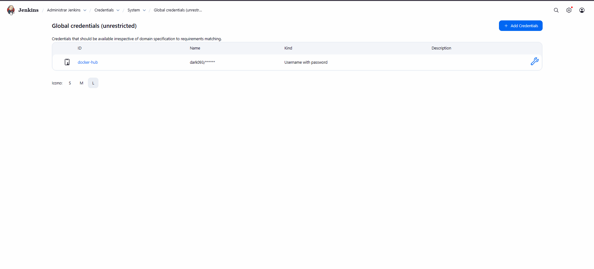

# Configuración de Credenciales en Jenkins

## Paso 1: Acceder a la gestión de credenciales

Después de iniciar sesión en Jenkins, ve al menú lateral y selecciona:

```
Manage Jenkins > Credentials
```

Esta sección permite almacenar de forma segura **usuarios, contraseñas, claves SSH y tokens de API** que se utilizan en pipelines o para conectar con servicios externos como GitHub, Docker o proveedores de la nube.

---

## Paso 2: Agregar una nueva credencial

1. Selecciona el **dominio** apropiado (Global o una carpeta específica).
2. Haz clic en **Add Credentials**.
3. Completa los campos requeridos según el tipo de credencial:

- **Tipo (Kind):** Usuario y contraseña, Texto secreto, Clave SSH, etc.
- **Alcance (Scope):** Global o limitado a una carpeta/tarea específica.
- **ID:** Opcional, se utiliza para referenciar la credencial en los pipelines.
- **Descripción (Description):** Breve descripción para identificar la credencial.

  
_Ejemplo de pantalla para agregar una nueva credencial en Jenkins._

---

## Paso 3: Guardar la credencial

Después de ingresar toda la información, haz clic en **OK** o **Save**.  
Tu credencial ahora estará disponible para usar en las tareas y pipelines de Jenkins.

---

## Paso 4: Agregar token de Docker Hub

Para usar Docker Hub directamente desde Jenkins, se recomienda crear una credencial con **token de acceso**.

- Usa este token al crear la credencial:

```
dckr_pat_ihxQmbr7-YmipVWEimRcZR3km0s
```

  
_Pantalla de creación de la credencial con token de Docker Hub._

  
_Credencial creada y lista para usar en Jenkins._

---

💡 **Consejos:**

- Siempre usa las credenciales de forma segura y evita incluir secretos directamente en los scripts de pipeline.
- Utiliza IDs y descripciones claras para que las credenciales sean fáciles de identificar.
- Para Docker Hub, utiliza **tokens en lugar de contraseñas**, para mayor seguridad.
