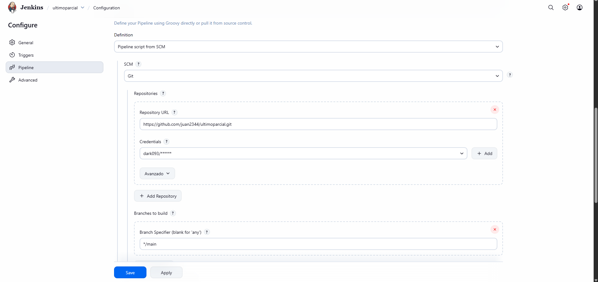
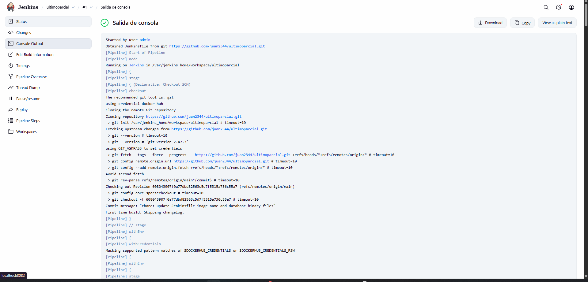

# Ejecución del Pipeline en Jenkins

Una vez configurado Jenkins, las credenciales, el acceso a GitHub y DockerHub, procedemos a ejecutar el Pipeline.  
Al hacerlo, Jenkins genera un registro llamado **Console Output**, donde se detalla paso a paso todo lo que está ocurriendo durante la automatización.

---

## Crear una nueva tarea (Pipeline)

1. En Jenkins, haz clic en **New Item**.
2. Asigna el nombre que desees a la tarea.
3. Selecciona el tipo **Pipeline**.
4. Presiona **OK**.

---

## Configurar el Pipeline

Configura la tarea de la siguiente manera:

- Asegúrate de escribir correctamente tu **usuario de GitHub**, ya que será necesario para la integración.
- En la sección **Pipeline**, agrega tu script o Jenkinsfile.
- Revisa que todo esté correcto, luego haz clic en:

**Apply → Save**

---

## Ejecutar el Pipeline

Haz clic en **Build Now** para iniciar el proceso.

Si todo está correctamente configurado, deberías ver un estado exitoso:

---

## ¿Qué es el Console Output?

El **Console Output** muestra:

- Descarga del repositorio GitHub
- Construcción del proyecto
- Login a DockerHub
- Creación y pushes de imágenes
- Resultado final (éxito o error)

Es una herramienta clave para diagnosticar problemas en el pipeline.
---
