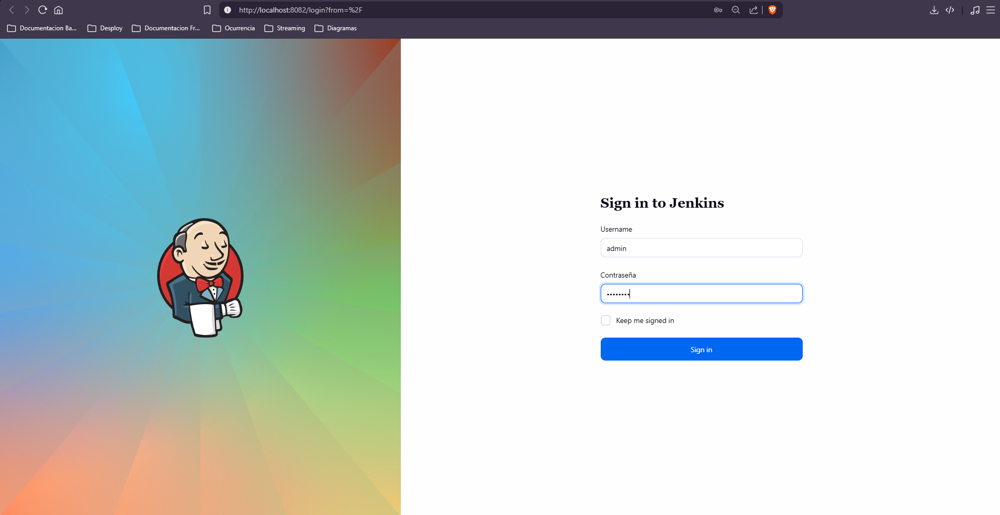
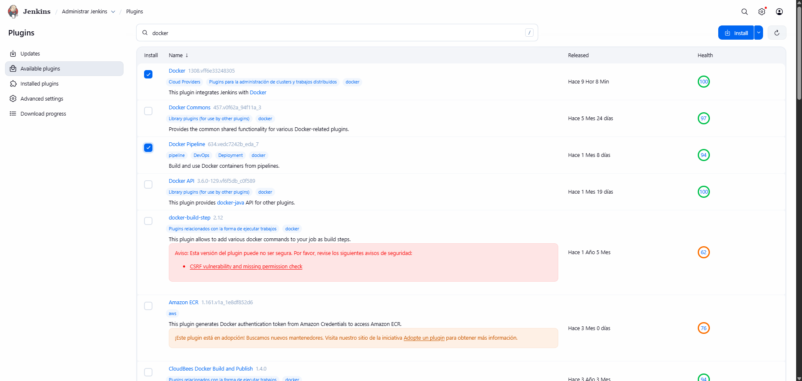

# Configuración inicial de Jenkins

## Paso 1: Acceder a Jenkins

Abre un navegador web (Firefox, Chrome, Edge, etc.) y escribe la siguiente URL en la barra de direcciones:

```text
http://localhost:8082
```

## Paso 2: Iniciar sesión

Al cargar la URL, se mostrará la pantalla de inicio de sesión de Jenkins. Ingresa las credenciales previamente configuradas:

- **Usuario:** `admin`
- **Contraseña:** `admin123`

## Paso 3: Confirmar que Jenkins está funcionando

Si logras acceder, significa que Jenkins se levantó correctamente mediante Docker y está listo para configurarse o ejecutar pipelines.


_Pantalla de inicio de sesión de Jenkins._

---

## Paso 4: Descargar plugins necesarios

Desde el dashboard de Jenkins:

```
Dashboard > Manage Jenkins > Manage Plugins
```


_Pantalla de inicio de sesión de Jenkins._

Selecciona los plugins requeridos y haz clic en **Install without restart**.

---

## Paso 5: Crear una nueva tarea (Job)

1. Haz clic en **New Item** en el dashboard de Jenkins.
2. Ingresa un nombre para tu tarea (puede ser cualquier nombre que quieras).
3. Selecciona **Pipeline** como tipo de proyecto.
4. Haz clic en **OK** para continuar.

---

## Paso 6: Configurar la tarea

- Configura el pipeline según tus necesidades.
- **No olvides ingresar tu usuario de GitHub correctamente**, ya que lo necesitaremos para conectar el repositorio más adelante.

Cuando termines, haz clic en **Apply** y luego en **Save**.

---

💡 **Nota:**
Asegúrate de que tu conexión a GitHub tenga los permisos necesarios para clonar repositorios y ejecutar pipelines desde Jenkins.
